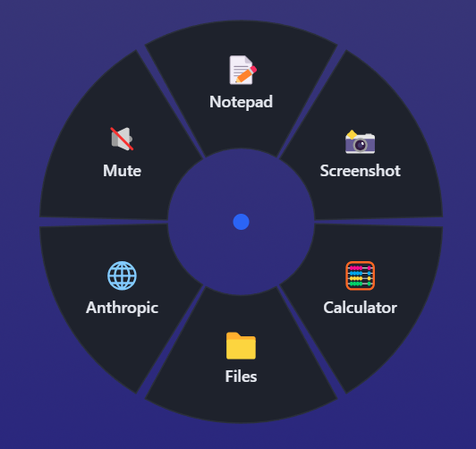
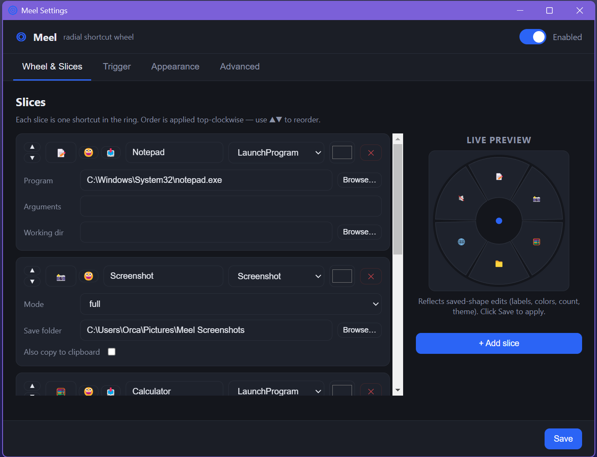

# Meel — a radial shortcut wheel for Windows

Press a spare mouse button, get a ring of shortcuts around your cursor, flick to
one, release. That's Meel.

Meel is a tray-resident Windows launcher. You bind a trigger — by default an
**extra mouse side button (MB4/MB5)** — and when you press it, a transparent,
dark-themed **radial wheel** pops up centered on your cursor. Each slice is a
shortcut: launch a program, take a screenshot, open a URL, run a command, and
more. Move the cursor toward a slice to highlight it, release (or click) to fire
it. A tray icon opens a fully customizable, dark-themed settings app.

<p align="center">
  
  <br />
  <em>The radial wheel — press your trigger, flick to a slice, release.</em>
</p>

<p align="center">
  
  <br />
  <em>The settings app — edit slices, import icons, pick themes, live preview.</em>
</p>

---

## Install

Download the latest **Meel Setup.exe** from
[Releases](https://github.com/ToxicOrca/meel-shortcut-wheel/releases) and run
it. Windows SmartScreen may warn on first launch since the app is unsigned —
click **"More info" → "Run anyway"**.

Alternatively, build from source (see [Setup & run](#setup--run-windows) below).

---

## Why this exists

Radial / pie menus are faster than hunting through the Start menu or a taskbar
because selection is **directional muscle memory**, not visual search — the same
reason they show up in games and pro creative tools. Meel brings that to
everyday Windows, triggered by a button your hand is already on: the mouse.

---

## Stack & honest justification

**Chosen stack: Electron + `uiohook-napi` + `screenshot-desktop`.**

### Why Electron

Two hard requirements drove the choice:

1. **The trigger needs a global, low-level input hook that can see extra mouse
   buttons.** This is the crux of the whole app. Electron's built-in
   `globalShortcut` API registers keyboard accelerators only — it **cannot**
   capture MB4/MB5 (or any mouse button). We need an OS-level hook.
   `uiohook-napi` installs exactly that (`SetWindowsHookEx` under the hood) and
   runs cleanly inside Electron's Node main process, reporting every global
   keyboard **and** mouse event including the side buttons.

2. **The radial wheel and the "highly customizable" settings app are UI-heavy
   and themeable.** Drawing an animated, dark-themed ring with per-slice icons,
   colors, and cursor-angle highlighting is dramatically easier in
   SVG/HTML/CSS than in a native UI toolkit, and a data-driven settings screen
   (dropdowns, color pickers, live-editable slice cards) is a natural fit for
   web tech. Electron gives us a transparent, always-on-top, click-through
   overlay window for the wheel plus a normal window for settings, both styled
   with plain CSS.

### The honest tradeoff: RAM footprint

Electron is not free. A tray-resident Electron app carries a **Chromium runtime
per process**, so an always-on launcher that just sits waiting for a button
press will use noticeably more memory (roughly ~100–200 MB depending on windows
open and Windows version) than a native or [Tauri](https://tauri.app/)
equivalent, which can idle in the low tens of MB. **For an always-on background
launcher, that overhead genuinely matters** — it's memory spent 24/7 for a tool
that's active for a fraction of a second at a time.

We're accepting that tradeoff deliberately to get fast iteration on the two hard
parts (the hook and the themeable UI). Because the UI is web tech and the
native surface area is tiny (one input hook + one screenshot call), **this is
portable to Tauri or a native shell later**: keep the HTML/CSS/JS wheel and
settings, swap the Electron main process for a Rust/native host that provides
the same global hook and screenshot bridge. If you outgrow the footprint, that's
the migration path.

### The riskiest part

**The global input hook is the trickiest and most failure-prone piece.** It is
a native module (must build or ship a prebuilt binary), it interacts with the OS
at a privileged level (antivirus may flag it, and it can't see input over
elevated windows unless Meel is also elevated), and correct press/release
sequencing across "hold" and "toggle" modes is fiddly. Treat `src/main/hook.js`
as the highest-attention code in the project.

### `screenshot-desktop`

Small library that shells out to the platform's native screen-grab facility and
returns a PNG buffer. Used for full-screen and region screenshot actions.

---

## Architecture

```
                    ┌─────────────────────────────────────────┐
                    │             Electron main               │
                    │            (src/main/main.js)           │
                    │                                         │
  physical input →  │  hook.js ── triggerdown/up/move ──┐     │
  (uiohook-napi)    │                                   ▼     │
                    │                        overlay-manager  │
                    │                          shows/hides ─┐ │
                    │  actions.js ◄── fire on release       │ │
                    │  config.js  (load/save userData JSON)  │ │
                    │  tray.js    (menu)                     │ │
                    └───────────┬──────────────────┬────────┘ │
                                │ IPC (preload)     │ IPC      │
                        ┌───────▼───────┐   ┌───────▼────────┐ │
                        │ overlay window │   │ settings window│ │
                        │  transparent,  │   │   dark theme   │ │
                        │  click-through │   │  edit config   │ │
                        │  SVG wheel     │   └────────────────┘ │
                        └────────────────┘◄───────────────────┘
                              draws slices, highlights by cursor angle
```

**Event flow (hold mode):**

1. `hook.js` sees the trigger button go down → emits `triggerdown` with the
   cursor position.
2. `main.js` asks `overlay-manager.js` to show the wheel centered there, using
   the active profile's slices and the appearance config.
3. As the mouse moves, `hook.js` emits `move`; the overlay highlights the slice
   whose angular wedge the cursor points at and reports the hovered slice id
   back to main.
4. On button release, `hook.js` emits `triggerup`; `main.js` hides the overlay
   and runs the hovered slice's action via `actions.js`.

**Security:** every renderer runs with `contextIsolation: true` and
`nodeIntegration: false`. Renderers touch nothing privileged directly — all
config reads/writes, file dialogs, and trigger capture go through a narrow
`contextBridge` API defined in the preload scripts. A restrictive CSP is set on
both HTML pages.

---

## File tree

```
meel-shortcut-mouse/
├── README.md
├── package.json                  # electron + uiohook-napi + screenshot-desktop; start/dist scripts
├── .gitignore
├── config/
│   └── default-config.json       # shipped defaults (Notepad, Screenshot, Calc, Files, URL, Mute)
├── LICENSE
├── assets/
│   ├── icon-256.png              # app icon (256×256, transparent)
│   ├── icon-32.png               # 32×32 variant
│   ├── icon-16.png               # 16×16 variant
│   └── tray-icon.png             # system-tray icon (32×32)
└── src/
    ├── shared/
    │   └── constants.js          # IPC channel names, mouse-button map, action-type list
    ├── main/
    │   ├── main.js               # entry: wires hook → overlay → actions, tray, IPC, lifecycle, cursor polling
    │   ├── hook.js               # global input hook (uiohook-napi) — debounce, enable-gate, the risky part
    │   ├── overlay-manager.js    # transparent, click-through, always-on-top overlay window
    │   ├── region-manager.js     # focusable drag-a-rectangle window for region screenshots
    │   ├── actions.js            # extensible action engine (Launch, Screenshot full/region/clipboard, hotkeys…)
    │   ├── tray.js               # tray icon + menu (Open Settings / Enable-Disable / Quit)
    │   └── config.js             # load/save/validate config JSON in userData, seeded from defaults
    ├── preload/
    │   ├── overlay-preload.js    # contextBridge API for the overlay renderer
    │   ├── region-preload.js     # contextBridge API for the region selector
    │   └── settings-preload.js   # contextBridge API for the settings renderer
    └── renderer/
        ├── overlay/
        │   ├── overlay.html      # SVG canvas for the wheel
        │   ├── overlay.css       # fully transparent, dark, no white flash
        │   └── overlay.js        # draws slices, cursor-angle selection, animation
        ├── region/
        │   ├── region.html       # region-selection surface
        │   ├── region.css        # dim overlay + selection rectangle
        │   └── region.js         # drag to select, report rect (Esc/right-click cancels)
        └── settings/
            ├── settings.html     # tabbed settings UI (Wheel/Trigger/Appearance/Advanced) + live preview
            ├── settings.css      # dark theme
            └── settings.js       # loads/edits/saves config, reorder, live preview, param editors
```

---

## Features

### Implemented

- **Configurable global trigger** via `uiohook-napi` — default MB4 (mouse side
  button). Supports **hold-to-open / release-to-activate** and
  **click-to-toggle** modes, with a short **debounce** against double-fire. The
  enable/disable toggle actually **gates the hook** (capture-for-rebind still
  works while disabled).
- **Radial overlay** — transparent, borderless, always-on-top, click-through
  window rendering N slices (icon + label) in a dark ring, with cursor-angle
  hover highlighting (**bright accent outline + glow** on the active wedge), a
  center dead-zone to cancel, and a scale/fade-in animation. Positioning uses
  DIP cursor coordinates polled from `screen.getCursorScreenPoint()`, so it is
  **correct on multi-monitor / HiDPI** setups (not the hook's raw physical px).
- **Actions engine** — data-driven objects dispatched by type. Implemented for
  real: **`LaunchProgram`** (exe + args + working dir), **`Screenshot`**
  (full **or drag-selected region**, save to folder, optional **copy to
  clipboard**), **`OpenURL`** (http/mailto only), **`OpenFolder`**,
  **`RunCommand`** (+ working dir), **`SendHotkey`** (combo → PowerShell
  `SendKeys`), **`MediaKey`** (volume/play-pause/next/prev via `keybd_event`
  through PowerShell). No native key-injection dependency needed. Adding a type
  = one handler + one `constants.js` entry + one settings param row.
- **Region capture** — a dedicated dark selection window; drag a rectangle
  (Esc/right-click cancels), and the grab is cropped to it (DIP→physical scaled
  by the display's `scaleFactor`).
- **Tray icon** with menu (left-click or right-click): Open Settings,
  Enable/Disable Meel, Quit. Custom blue concentric-circles icon.
- **Companion settings app** (dark, highly customizable): set the trigger button
  (press-to-capture) and mode; add/remove/**reorder (▲▼)**/edit each slice's
  action, label, icon, and color with type-specific parameter editors; **emoji
  picker** for slice icons; **import program icon** from any `.exe` or `.lnk`
  shortcut; tune wheel appearance (radius, inner radius, slice gap, animation,
  labels) with **size presets** (Compact / Default / Large / etc.) and **10
  theme presets** (Default Dark, Midnight Blue, Deep Purple, Nord, Ember,
  Forest, Slate, Dracula, Monokai, Ocean) plus full manual color control;
  **live preview** mini-wheel with recursive sub-wheel rendering;
  **start-on-login** toggle; shows the config file path; profile selector.
- **Nested sub-wheels** — any slice can contain child slices displayed as a
  concentric outer ring. A collapsed indicator appears outside parent slices;
  moving the cursor to it expands the sub-ring with full labels. Supports
  arbitrary nesting depth. In the settings editor, click **⊕** on any slice
  to convert it to a sub-wheel, or set the action type to `SubWheel`.
- **Config persistence + validation** — JSON in Electron `userData`, seeded from
  `config/default-config.json`, reloaded live on save. On load the config is
  **validated and deep-merged over defaults** so a partial, malformed, or older
  file is repaired (never crashes the app). Ships with example slices.

### Still stubbed / best-effort (test on Windows)

- **`SendHotkey`** uses PowerShell `SendKeys`, which can't express every
  low-level chord (notably Win-key combos); those would need a real injector.
- **Region cropping coordinates** are computed for the display under the cursor
  using `scaleFactor`; mixed-DPI multi-monitor mapping may need tuning.
- **Per-display full-screen capture** matches Electron displays to
  `screenshot-desktop` by index and falls back to the primary display.
- **Profiles** — the config supports multiple, but the UI only selects the
  active one (no create/rename/switch-trigger yet).

### Roadmap

**v1 (still to do):**

- Upgrade `SendHotkey` to a true injector (`@nut-tree/nut-js` / `robotjs`) for
  Win-key chords and reliability; tune region cropping on mixed-DPI rigs.
- Multiple **profiles/wheels** and a modifier to switch between them.
- Code-sign the build to reduce antivirus friction.

**Later / migration:**

- Port the host to **Tauri or native** to cut the idle RAM footprint, keeping
  the web UI. Provide the same global-hook + screenshot bridge in Rust.
- Code-sign the binary to reduce antivirus false positives.

---

## Setup & run (Windows)

> Meel targets **Windows**. The global hook and screenshot paths are
> Windows-first. Build/run on Windows, not WSL.

**Prerequisites**

1. **Node.js LTS** (18 or 20+) — <https://nodejs.org>.
2. **Native build tools** *(only if a prebuilt binary isn't fetched for your
   Node/Electron combo)*: install **Visual Studio Build Tools** with the
   **"Desktop development with C++"** workload, plus Python 3. `uiohook-napi`
   ships prebuilt binaries for common setups and usually needs no compiler, but
   have these ready in case node-gyp has to build from source.

**Install & run**

```powershell
cd meel-shortcut-mouse
npm install        # pulls electron, uiohook-napi, screenshot-desktop (+ native bits)
npm start          # launches Meel — look for the tray icon
```

Then: click the tray icon → **Open Settings** to bind your trigger and
edit slices. Press your trigger (default MB4) anywhere to pop the wheel.

**Build a distributable installer**

```powershell
npm run dist       # electron-builder → NSIS installer in dist/
```

---

## Real-world gotchas (read these)

- **Antivirus may flag the global input hook.** A low-level keyboard/mouse hook
  looks, structurally, like a keylogger to heuristic AV — because the mechanism
  is the same one keyloggers use. Expect possible warnings from Windows
  Defender or third-party AV on first run. Mitigations: **code-sign** the build,
  and if needed add an AV exclusion for the app folder. This is inherent to any
  app that reads global input.
- **Capturing input over elevated / admin windows needs elevation.** Windows
  UIPI (User Interface Privilege Isolation) blocks a normal-integrity process
  from receiving input events while an **elevated** window (an app running as
  Administrator) is focused. If you want the wheel to trigger over admin apps,
  **run Meel as administrator** too. Trading up: running elevated is a bigger
  security surface, so only do it if you need it.
- **The trigger button's default action still fires (no event suppression).**
  `uiohook` is a *listening* hook — it reports input but cannot swallow it. So if
  you bind MB4, pressing it opens the wheel **and** still sends MB4's normal
  action (e.g. "browser back") to the focused app. There is no reliable cross-app
  way to suppress this from Node. Mitigations: pick a side button that has no
  default action in the apps you use, or remap that button to "unassigned" in
  your mouse vendor's software (Logitech/Razer/etc.), or use a keyboard trigger.
- **`SendHotkey` / `MediaKey` shell out to PowerShell.** They run
  `powershell.exe -Command …` (with `keybd_event`/`SendKeys`). If a strict
  execution policy or security tool blocks inline PowerShell, those two actions
  won't work; everything else is unaffected.
- **`globalShortcut` won't help here** — restating the core reason for the
  native hook: Electron's built-in shortcut API cannot capture mouse buttons, so
  the native module is mandatory, not optional.
- **Native module ↔ Electron ABI.** `uiohook-napi` is native; if you upgrade
  Electron and hit a "was compiled against a different Node.js version" error,
  run `npm run postinstall` (it calls `electron-builder install-app-deps`) or
  `npx electron-rebuild` to rebuild native modules against Electron's ABI.
- **Multi-monitor / DPI.** The overlay is positioned on the display under the
  cursor. On mixed-DPI setups, verify the wheel centers correctly and adjust
  radius in settings if needed.
- **The wheel window is click-through by design.** Real selection comes from the
  global hook's cursor tracking, not from the window receiving clicks — so don't
  expect the overlay to respond to normal mouse events.

---

## License

MIT — see [LICENSE](LICENSE).
